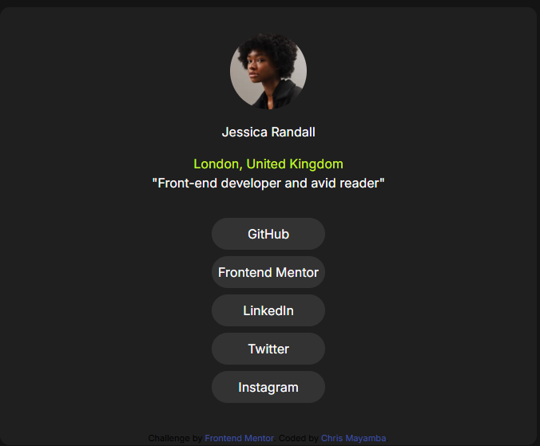

# Frontend Mentor - Social links profile solution

This is a solution to the [Social links profile challenge on Frontend Mentor](https://www.frontendmentor.io/challenges/social-links-profile-UG32l9m6dQ). Frontend Mentor challenges help you improve your coding skills by building realistic projects. 

## Table of contents

- [Overview](#overview)
  - [The challenge](#the-challenge)
  - [Screenshot](#screenshot)
  - [Links](#links)
- [My process](#my-process)
  - [Built with](#built-with)
  - [What I learned](#what-i-learned)
  - [Useful resources](#useful-resources)
- [Author](#author)
- [Acknowledgments](#acknowledgments)

## Overview


### The challenge

Users should be able to:

- See hover and focus states for all interactive elements on the page

### Screenshot



This is how the web page appears.
I modified it by adding a personal layer

### Links

- Solution URL: [Add solution URL here](https://your-solution-url.com)
- Live Site URL: [Add live site URL here](https://your-live-site-url.com)

## My process

### Built with

- Semantic HTML5 markup
- CSS custom properties


### What I learned

I've learnt how to structure my web page better

```html
<div>
  <a class="links" href="https://github.com/">GitHub</a></p>       
  <a class="links" href="https://www.frontendmentor.io/">Frontend Mentor</a></p>
  <a class="links" href="https://fr.linkedin.com/">LinkedIn</a></p>
  <a class="links" href="https://twitter.com/?lang=fr">Twitter</a></p>
  <a class="links" href="https://www.instagram.com/">Instagram</a></p>      
</div>
```


### Useful resources

- [MDN mozilla](https://developer.mozilla.org/en-US/) - This helped me for search for html and css elements. I really liked this pattern and will use it going forward.
- [W3 school](https://www.w3schools.com/) - This helped me much more with css. I'd recommend it to anyone still learning this concept.


## Author

- Website - [chris mayamba](https://www.your-site.com)
- Frontend Mentor - [@chris-mayamba](https://www.frontendmentor.io/profile/chris-mayamba)


## Acknowledgments

By way of thanks, I'd like to thank all my families, especially my father for the data that enabled me to take a course on appbrewery. I would also like to thank my cousin Winders for paying for this very rewarding course.

Thank you all!

